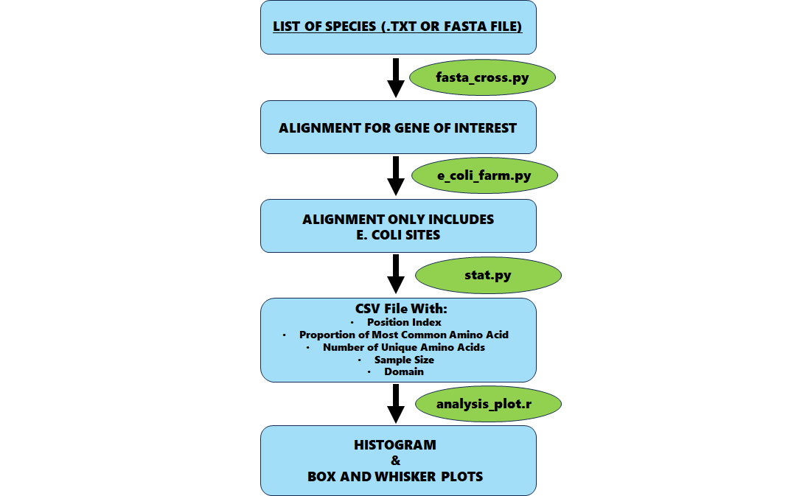

# BamA Comparative Genetics

The purpose of this project is to analyze the conservation of the protein BamA and its
satellite POTRA domains.

# Contents

- [Abstract](#abstract)
- [Methods](#methods)
  - [Scripts](#scripts)
  - [Pipeline](#pipeline)
- [Process](#process)
  - [Installation] (#installation)
  - [Conditions](#conditions)
  - [Walkthrough](#walkthrough)

## Abstract

$\beta$-barrel assembly machinery (BAM) is a protein complex vital to cell
survival in gram-negative bacteria that functions to insert proteins into the
cell’s outer membrane. BamA, a protein composed of a membrane-bound beta barrel
and several POTRA domains that protrude into the cytosol, is the primary subunit
within BAM. It is suggested that BamA is conserved due to its widespread
presence across the bacterial tree of life. Here we quantify the conservancy of
BamA in 142 species of gram-negative bacteria from across the bacterial tree of
life, with a focus on 120 species belonging to the order Enterobacterales. In
addition, we compared the conservancy of BamA with other proteins with high and
moderate levels of conservation in Enterobacterales. Lastly, we discuss regions
of BamA that are of high conservation in the context of their potential as
antibiotic targets.

## Methods

### Scripts

* fasta_cross.py extracts the naming conventions of one FASTA file and aligns it
  with the naming conventions of another.
  * Using *Escherichia coli* as our example:
    * GenBank convention = pdb|6V05|A:1-810 Chain A, Outer membrane protein
      assembly factor BamA
    * Project convention = Enterobacteriaceae-[Escherichiacoli]

* e_coli_farm.py takes a multiple sequence alignment FASTA file and "farms" the
  alignment for anything not present in a given species (default for this
  project is *Escherichia coli*)
  * Removes all columns not represented by target species
    * Eliminates gaps in target species and adjusts all other amino acid
      sequences
  * Writes farmed sequences to new FASTA file

* stat.py takes a multiple sequence alignment FASTA file and tracks statistics
provided by the Position class across the entire alignment, writing them to CSV
files.
  * position.py creates the Position class to calculate particular statistics at
given positions along the amino acid sequence alignment. Such statistics include
    * Sample Size: Number of amino acids present at a given position, excluding
    gaps
    * Unique Amino Acids: The number of unique amino acids represented at the given
    position
    * Proportion: The proportion of the most common amino acid to the total
    amount of amino acids found at a given position
  * Removes significant gaps from alignments
  * Makes note of positions that are significantly conserved
    * Expecting the protein to be fairly well conserved amongst different taxa,
      though less and less the farther back in the phylogenetic distance we reach
    * Expecting the protein to be highly conserved just in Enterobacterales

* analysis_plot.r takes a CSV file with statistics about position objects and
  turns them into histogram & box and whisker plots before saving them into PNG
  files
   * \*_histogram.png
     * Histogram plot
     * Positions at or above 98% conservation are color coded red
   * \*_box.png
     * Includes box and whisker plots & violin plots

### Pipeline

## Process

### Installation

To clone this repository using HTTPS, enter the following into the command line:

    $ git clone https://github.com/KLab-UT/BAM_comparative_genetics.git

To clone this repository using SSH, enter the following into the command line:

    $ git clone git@github.com:KLab-UT/BAM_comparative_genetics.git

### Conditions

As it stands, the scripts in this project are set to run on the conditions that

1. We are looking at BamA and its POTRA domains, and
2. Escherichia coli is present in the alignments and will be the base species
   around which data will be manipulated

Future modifications to the scripts will be to make it generalized for any given
species and, ideally, any given protein one wants to analyze conservation.

The walkthrough will be based around the test FASTA file
`enterobacterales_test.fa`, so you can get a feel for the process required to
analyze the conservation of BamA.

### Walkthrough

We start with `enterobacterales_test.fa`, a FASTA file of a multiple amino acid
sequence alignment. There are 128 species represented by 128 amino acid
sequences of the BamA protein.

With the FASTA file, the next step will be to run it through `e_coli_farm.py`,
a script that will "farm" the alignment of gaps that are not present in the
sequence of *Escherichia coli*.

    $ python e_coli_farm.py --infile enterobacterales_test.fa

This will produce `enterobacterales_test_farmed.fa`.

With the farmed FASTA file, we can get to the actual conservation analysis. To
do that, run `enterobacterales_test_farmed.fa` through the `stat.py` script.

    $ python stat.py enterobacterales_test_farmed.fa

This will produce two CSV files, `enterobacterales_test_farmed_stats.csv` and
`enterobacterales_test_farmed_conserved.csv`. The latter file contains each
position and its most common amino acid with a proportion above 98%.

The former is what we will use to create our plots using the R script
`analysis_plot.r`.

    $ Rscript analysis_plot.r

`analysis_plot.r` will automatically look through the current working directory
(ideally the cloned repository) for any CSV files ending in `*stats.csv`.

Running `analysis_plot.r` will create two PNG files,
`enterobacterales_test_farmed_stats_box.png` and
`enterobacterales_test_farmed_stats_histogram.png`, respectively the box and
histogram plots showing the conservation of BamA and its POTRA domains across
the 128 sequences of this test file.

### Final Products

